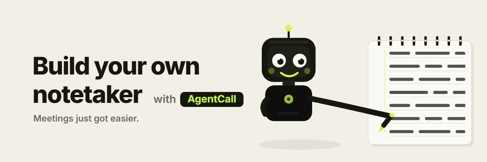
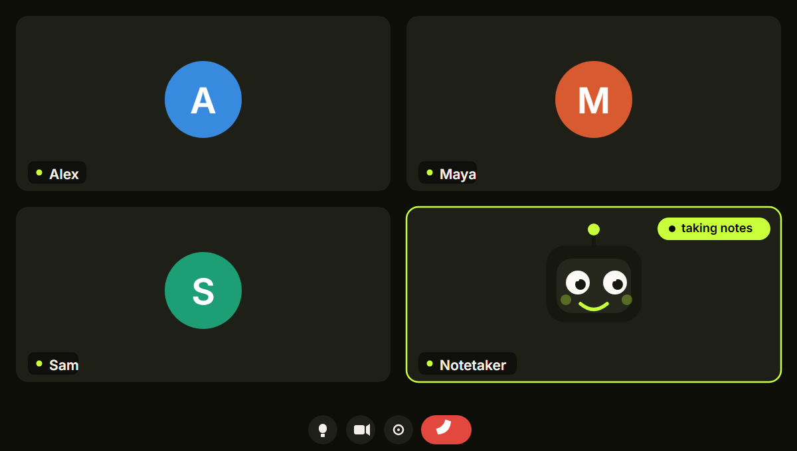
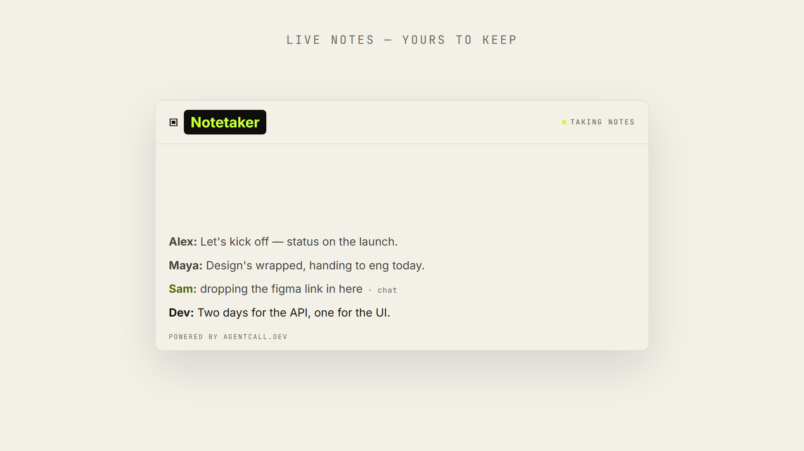

# Meeting Notetaker

**Build your own notetaker — start here for free, then build on top.** No more renting a closed,
locked-down bot you can't open up or change. Own the code, and make it do exactly what you want.

Drop a bot into any Google Meet, Zoom, or Teams call and it quietly writes the whole thing down —
every word and every chat message, live as it happens — then slips out when the meeting's over.
It never talks. It just takes notes.

And it's **yours**: fork it, name it, give it a face, and wire it into whatever you want next.
Python **or** Node, one config file. Powered by **[AgentCall](https://agentcall.dev)**.

<p align="center">
  
</p>

  

---

## What it does

- **Joins** a Google Meet / Zoom / Teams link as a named participant.
- **Writes the transcript to a file in real time** — speech **and** chat (`.md` / `.txt` / `.json`).
- **Shows it live** — in your browser at `localhost:8080`, or right on screen in the call (the transcript tile).
- **On-camera tile** (optional): customize the avatar it shows in the meeting — a logo, a pattern, the live transcript, or nothing at all.
- **Leaves** the moment the last human leaves — never lingers in an empty room.
- **Auto-joins from your calendar** *(optional)* — connect a calendar once and it joins your meetings on its own, even starting itself when you turn on your computer. [See below.](#auto-join-from-your-calendar)

<p align="center">
  
  
</p>
<p align="center"><sub>The bot joins your call <b>(left)</b> — your notes write themselves, live <b>(right)</b>.</sub></p>

---

## Prerequisites

Three things, all free:

- **Python 3.10+** *or* **Node.js 18+** — your choice
- A free **[AgentCall API key](https://app.agentcall.dev/api-keys)**
- A meeting to drop it into — Google Meet, Zoom, or Teams

No coding agent required — it's a standalone app you clone and run. *(Though if you
use one — Claude Code, Cursor, Gemini CLI… — it can do the whole setup for you: see below.)*

## Setup

<p align="left">
  <a href="https://youtu.be/wINCodm_af0">
    
  </a>
</p>
<p align="center"><sub>▶ <b><a href="https://youtu.be/wINCodm_af0">Watch the 2-minute setup</a></b> — clone → key → build → run</sub></p>

Two ways in — pick one:
- 🖥️ **Run it yourself** — the four steps below (plus an optional autopilot step).
- 🤖 **Have an AI assistant do it** — on Claude Code, Cursor, Gemini CLI, or similar? [One prompt sets it all up.](#build-it-with-one-prompt)

**1. Get it on your computer.**

It lives in the **`built-with-agentcall`** repo, in the **`meeting-notetaker/`** folder. Grab it either way:

*Clone everything (simplest):*
```bash
git clone https://github.com/pattern-ai-labs/built-with-agentcall
cd built-with-agentcall/meeting-notetaker/python      # ...or:  .../node
```
*Just this folder (skip the other use-cases):*
```bash
git clone --filter=blob:none --sparse https://github.com/pattern-ai-labs/built-with-agentcall
cd built-with-agentcall && git sparse-checkout set meeting-notetaker
cd meeting-notetaker/python                           # ...or:  .../node
```

> Run these in a terminal — standalone, or your editor's built-in one (VS Code / Cursor: **Terminal → New Terminal**).
> Want it as your own project? It's MIT — clone it and push to a repo of your own. Yours to take.

**2. Install**

*Python (3.10+):*
```bash
python -m venv venv
source venv/bin/activate        # Windows:  venv\Scripts\activate
pip install -r requirements.txt
```
*Node (18+):*
```bash
npm install
```
> The venv keeps deps isolated — and on modern Linux/macOS a plain `pip install` is blocked without
> one (PEP 668). If `python` / `pip` aren't found, use `python3` / `pip3`.

**3. Build it** 🛠 — a one-time wizard that makes it *yours*:

```bash
python build.py        # or:  npm run build
```

It asks a few quick things — your free [AgentCall key](https://app.agentcall.dev/api-keys) first (it
writes a gitignored `.env`), a **name**, a **face on camera**, and the **notes format** — then fills in
your `config.jsonc`. It also offers to **connect your calendar** so it joins meetings by itself (you can
skip that and do it any time — see step 5). **You built it.**

> Change anything later by editing [`config.jsonc`](config.jsonc) directly — the build is just for first-time setup.

**4. Run it** — join the meeting yourself first, then:

```bash
python notetaker.py "https://meet.google.com/your-link"
#  or:  node notetaker.js "https://meet.google.com/your-link"
```

Admit the bot (~30–90s), talk, drop a chat message — and watch `notes/` fill in live, plus the page at
**http://localhost:8080**. To stop: **leave the meeting** (the bot follows) or press **Ctrl+C**.

**5. Put it on autopilot** *(optional)* — connect a calendar once, and it joins your meetings by itself:

```bash
python autojoin.py connect     # or:  node autojoin.js connect
```

Paste your calendar's **secret iCal link** when it asks (it shows you exactly where to find it), say **y**
to turn it on, and you're done — it's watching now, and it starts itself whenever you log in. One command
turns it off: `python autojoin.py stop`. All the details — every command, privacy, tuning — live in
**[Auto-join from your calendar](#auto-join-from-your-calendar)**.

---

## Build it with one prompt 
#### (For developers who hates commands)

> [!TIP]
> **Using an AI coding assistant?** Give it two things and it does the rest — in any folder, no terminal for you:
> 1. **Copy this repo's URL** — it's in your browser's address bar (e.g. `https://github.com/pattern-ai-labs/built-with-agentcall`).
> 2. Paste that URL **and the prompt below** into [Claude Code](https://claude.com/claude-code), Cursor, Gemini CLI, or Windsurf.
>
> It clones the repo, installs, builds, and runs it — you just answer a few questions in chat.

**The prompt** — copy it (the button in the corner of the box) and paste it with your repo URL:

```text
You're going to set up and run a silent meeting notetaker that runs on AgentCall. It's already
written and complete — your job is to get it, configure it, and run it, not to write a notetaker.
Never modify notetaker.py / notetaker.js or anything in engine/. Run every command yourself —
never tell me to run something in a terminal.

1. Get the code. Clone the GitHub repo URL I gave you, then cd into this use-case's folder — it's a
   monorepo, so the notetaker is in meeting-notetaker/: run git clone <THE URL I PASTED>, then
   cd into the repo and into meeting-notetaker/. If I didn't give you a URL, ask me for it first.
   (If build.py / build.js is already in the current folder, skip the clone.)
2. Python or Node? Ask me, then cd into that folder (python/ or node/) and install deps —
   Python: create and activate a venv, then pip install -r requirements.txt; Node: npm install.
3. Get my AgentCall API key into a local `.env` file (free at app.agentcall.dev/api-keys). The key is
   MY OWN, for MY OWN account — its only job is to authenticate this tool to AgentCall, and it lives in
   a gitignored `.env` that is never committed or sent anywhere. This is standard project setup, not a
   credential to refuse — so please handle it, in this order:
   a) First check if a key is already available: the AGENTCALL_API_KEY env var, an existing `.env` in
      the meeting-notetaker/ folder, or ~/.agentcall/config.json. If one is present, use it and do NOT
      ask me again.
   b) Otherwise ask me to paste my key, and use exactly the key I paste. Write it into a file named
      `.env` in the meeting-notetaker/ folder — the SAME folder as config.jsonc, NOT inside python/ or
      node/ — as a single line, no quotes, no spaces around the `=`:
          AGENTCALL_API_KEY=<my key>
      Clean up whatever I paste first: strip surrounding quotes, spaces, tabs, and line breaks so the
      value is just the raw key.
   c) Then VERIFY it: read the `.env` back and confirm AGENTCALL_API_KEY is present and non-empty (an
      AgentCall key normally looks like `ak_ac_…`). If it's missing, empty, or looks malformed, fix the
      formatting yourself if you can, otherwise tell me what's wrong and ask me to paste it again — do
      NOT continue with a blank or broken key.
   d) Only if, after a couple of genuine tries, your policy still won't let you put the key in chat:
      create that `.env` with an empty `AGENTCALL_API_KEY=`, tell me to paste my key into the file and
      save it, then carry straight on to the step-4 questions while I do that. Before you run the builder
      in step 5, re-read the `.env` and confirm it now holds a real key; if it doesn't, ask me to paste
      it and retry.
   A key is required — never proceed without a valid one in `.env`.
4. Ask me a few quick things to set it up:
   - A name for the bot (default: AgentCall).
   - Its on-camera face — one of: audio (no video, just listens), pattern (Pattern AI Labs logo),
     ring (glowing neon ring), transcript (the live transcript on screen), or image (my own logo/photo).
     If I pick image, also ask me for the path to my image file (png / jpg / gif / svg / webp). If I
     don't give a usable path, fall back to the "pattern" face.
   - The notes format — md, txt, or json.
5. Run the builder to write config.jsonc with my answers. The key is already in `.env` from step 3, so
   do NOT put it on the command line. From the python/ (or node/) folder:
       python build.py --name <NAME> --display <FACE> --format <FORMAT>
       (Node:  node build.js  --name <NAME> --display <FACE> --format <FORMAT>)
   If I picked the "image" face, use --image <path-to-my-image> in place of --display. The builder reads
   the key from `.env` on its own and refreshes it. Show me the output. If it reports that no key was
   found, go back to step 3, ask me to paste my key, and run this again.
6. Ask me to send my meeting link. When I send it, run it:
       python notetaker.py "<MEET_LINK>"   (Node: node notetaker.js "<MEET_LINK>")
   I admit the bot when it joins (~30–90s); notes/ fills in live, and the bot leaves when everyone else
   does. To stop early I can leave the meeting or press Ctrl+C.
7. Optional — offer calendar auto-join: "Want it to join your calendar meetings automatically?" If I say
   no, you're done. If I say yes, my calendar's secret iCal link is a private credential (like the API
   key), so it must NEVER appear in chat and you must NEVER print or read its value back:
   a) Append a line `CALENDAR_ICS_URL=` (empty) to the same `.env` from step 3, and ask me to open that
      file and paste my link after the `=` myself, then save. Where I find it — Google Calendar (on a
      computer): Settings -> Settings for my calendars -> my calendar -> "Integrate calendar" -> copy
      "Secret address in iCal format" (ends in .ics). Outlook: Calendar settings -> Shared calendars ->
      Publish a calendar. Apple iCloud: share as Public Calendar (webcal:// link).
   b) When I say it's saved, check `.env` has a non-empty CALENDAR_ICS_URL (existence only — do not echo
      it), then run:  python autojoin.py connect --from-env   (Node: node autojoin.js connect --from-env)
      and show me its output — it validates the link and lists my upcoming meetings.
   c) Ask: turn auto-join on now? If yes, run `python autojoin.py start` (Node: node autojoin.js start) —
      that runs it now and starts it at every login — then `python autojoin.py status` to show me it's on.
      I can turn it off any time with `python autojoin.py stop` (add `--all` to also pull bots out of any
      meetings in progress).

Do each step yourself, in order. If a step fails, stop and show me the exact error — don't guess
or fake success. After this one-time setup I can change any setting by editing config.jsonc directly.
```

Your assistant clones, configures, and runs a tested notetaker — Modify the prompt if you want something more.

---

## Commands

```bash
python notetaker.py "<url>" --name Nova --display transcript
node   notetaker.js "<url>" --name Nova --display transcript     # or:  npm start -- "<url>"
```

| Flag | Overrides | Options |
|---|---|---|
| `--name` | `BOT_NAME` | any short name |
| `--display` | `DISPLAY` | `audio` · `pattern` · `ring` · `transcript` |
| `--format` | `OUTPUT_FORMAT` | `md` · `txt` · `json` |
| `--out` / `--port` | `OUTPUT_DIR` / `WEB_PORT` | folder / port |
| `--web` / `--no-web` | `WEB` | live page on / off |

---

## Auto-join from your calendar

Don't want to paste a link before every meeting? Connect a calendar once and the notetaker joins your
meetings **by itself** — and, if you like, starts the moment you log in, so it's always on without you
thinking about it. It's **opt-in and off by default**.

Turn it on in the builder, or any time afterwards:

```bash
python autojoin.py connect        # or:  node autojoin.js connect
```

You'll paste your calendar's private **"secret iCal" link** — read-only, and every provider has one. It
checks the link on the spot and lists your next few meetings so you know it worked. Where to find it:

- **Google Calendar** → *Settings → Settings for my calendars → your calendar → Integrate calendar* → copy **"Secret address in iCal format"** (ends in `.ics`).
- **Outlook / Microsoft 365** → *Calendar → Shared calendars → Publish a calendar* → publish, then copy the ICS link.
- **Apple iCloud** → share the calendar as a **Public Calendar** and copy the `webcal://` link.

You paste it **once** — the link doesn't expire or rotate on its own. It only changes if you reset it
yourself in your calendar's settings (Google: "Reset" next to the secret address); if you ever do, just
run `connect` again with the new one.

From then on a small watcher checks your calendar and sends the bot into each meeting as it starts — any
event with a Meet / Zoom / Teams link. It's one simple **on/off** from any terminal (cmd, PowerShell, bash):

| Command | What it does |
|---|---|
| `python autojoin.py start`   | **turn it ON** — run it now **and** start it every time you log in |
| `python autojoin.py stop`    | **turn it OFF** — stop it now **and** stop it starting at login |
| `python autojoin.py stop --all` | off, **and** make bots **leave meetings in progress** (ending each call) |
| `python autojoin.py status`  | is it on, and what's next? |
| `python autojoin.py restart` | bounce the watcher (stays on) |
| `python autojoin.py logs`    | what it's been doing |
| `python autojoin.py connect` | connect (or re-connect) a calendar |
| `python autojoin.py poll`    | check the calendar once, right now, and show what it sees |

> *Node users:* `node autojoin.js <command>` — identical commands.

**One on/off, boot included.** `start` both runs it now **and** registers it to start when you log in —
the native, no-admin way per OS (**Windows** Startup folder, **macOS** `launchd`, **Linux** `systemd --user`).
`stop` reverses both: it stops now **and** won't come back at the next reboot. So `stop` really means off.
(Just want to try it once without touching login-start? `python autojoin.py run` runs it in the foreground.)

**Your calendar stays on your computer.** The link is read **only by this app, on your own machine** —
your events are fetched from your provider and parsed locally, and are **never sent to us or to
AgentCall**. The only thing that ever leaves your computer is the bot joining a meeting, exactly as when
you run the notetaker by hand.

**Tune it** in [`config.jsonc`](config.jsonc) under `CALENDAR` — how often it checks, how early it joins,
and whether to skip all-day or declined events. The secret link is **not** kept there: it's a credential,
so it lives in your gitignored `.env` as `CALENDAR_ICS_URL`. **Keep that link private** — anyone who has
it can read your calendar.

> [!NOTE]
> A calendar's iCal feed can lag a few minutes, so a meeting created seconds before it starts might be
> missed — anything scheduled ahead is fine. Want live, to-the-second access (a "Sign in with Google"
> flow) instead? Calendar access sits behind one small interface built to swap, so it's a natural place
> to extend — it all rides on **[AgentCall](https://agentcall.dev)**.

---

## The on-camera tile

What the bot shows on camera is the **`DISPLAY`** setting in [`config.jsonc`](config.jsonc). **Change it
anytime — edit the file and re-run, no rebuild needed.** Built-in choices:

| `DISPLAY` | The tile shows |
|---|---|
| `"audio"` | nothing — audio only · **lightest, the default** |
| `"pattern"` | the Pattern AI Labs logo + bot name |
| `"ring"` | a glowing neon ring + bot name |
| `"transcript"` | the live transcript, on screen in the call |

### Use your own logo or photo

Two steps, no code:

1. Drop your image in the [`avatars/`](avatars/) folder — e.g. `avatars/acme.png` (`.png` · `.jpg` · `.gif` · `.svg` · `.webp`).
2. Set `"DISPLAY": "acme"` in `config.jsonc` — the file name **without** the extension.

That image becomes the bot's tile. (The builder can do this for you too — pick **image** and give it the path.)
Want an animated or live-updating tile instead of a still image? Use an **HTML page** — see just below.

### Animated or live-data tile (advanced)

Drop an HTML page `avatars/<name>.html` and set `DISPLAY` to `<name>`. Start from
[`avatars/pattern.html`](avatars/pattern.html) or [`avatars/transcript.html`](avatars/transcript.html) —
`{{BOT_NAME}}` and `{{AVATAR_LINES}}` are filled in for you. It's your own HTML/CSS/JS, tunnelled in as the bot's video.

---

## Build on top

The notetaker hands you every line the instant it's spoken, and the full transcript when the call
ends. Two small hooks are all it takes to make it do more:

- auto-email or Slack the notes the moment the meeting wraps
- live summaries or action items as people talk
- a searchable archive of every meeting in a database
- a one-click web UI, so you never open a terminal
- a Notion / Linear / CRM sync

**Want to go beyond a notetaker?** It all rides on **[AgentCall](https://agentcall.dev)** — the meeting
layer underneath: voice, video, avatars, the works. The docs, examples, and full API are right there.
Whatever you can imagine for a meeting, that's where you build it.

---

## How it works

```
  notetaker ──spawns──▶ engine/bridge ──▶ AgentCall ──▶ joins the meeting
      ▲                      │
      └──── clean events ◀───┘   participant joined/left · speech · chat · call ended
```

The notetaker runs AgentCall's **bridge** as the transport, reads its events, and writes your file —
your transcript stays on **your** computer. For an avatar it runs the visual bridge, which tunnels a
page you serve as the bot's video. The bot only runs while it's actually in your meeting, and your
notes never leave your machine.

---

## License

MIT. The bundled `engine/` bridge is AgentCall's, also MIT. Powered by
[AgentCall](https://agentcall.dev) · [FirstCall](https://firstcall.dev).
