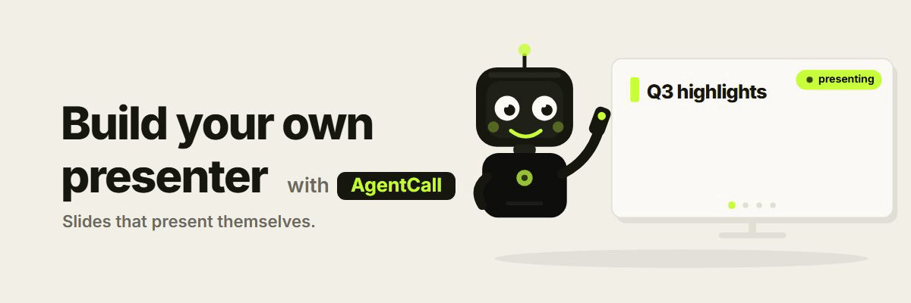
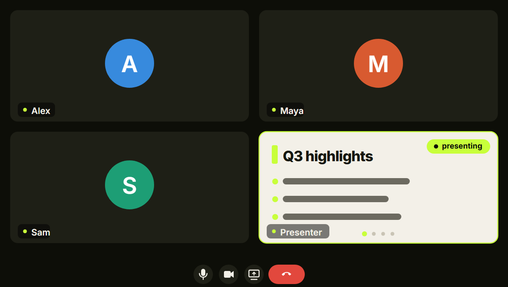
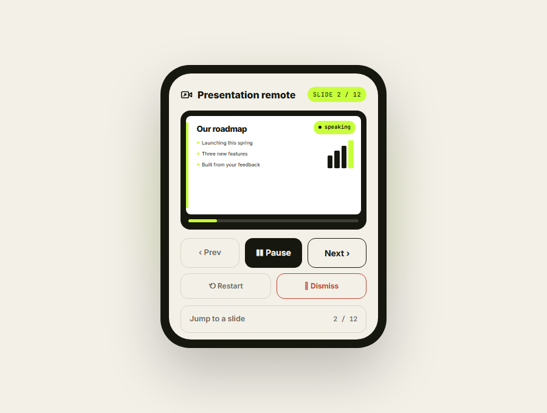

# Meeting Presenter

**Build your own meeting presenter — a skill that turns your AI agent into a presenter.**
It joins your Google Meet, Zoom, or Teams call and delivers your slides *for* you: each slide shows on
its camera, narrated aloud in its own voice, advancing on its own. You (or anyone in the call) steer it
by voice or a control page. Hand it a **PowerPoint, PDF, or Word doc**, or just tell it a **topic**, and
it presents. It's yours to fork, rename, restyle, and build on. Powered by **[AgentCall](https://agentcall.dev)**.

<p align="center">
  
</p>

   

---

## What it does

- **Joins** a Google Meet / Zoom / Teams link as a participant.
- **Puts your slides on the meeting's main stage** — the real slides, shared big and readable, with the
  bot's **face in a small camera tile**. (Prefer the original single-tile look, slides *on* the camera?
  add `--avatar-mode`.)
- **Narrates every slide aloud** in its own voice, then moves to the next on its own. The voice is
  built in (it speaks through AgentCall) — no extra AI needed just to talk.
- **You steer it by talking to it** — say its name (*"Presenter, go back to the pricing slide"*,
  *"Presenter, what's the timeline?"*) and **your agent** decides what to do: change slides, answer the
  question, or steer back if it's off-topic. Its name is the only trigger, so it stays quiet through the
  rest of the meeting — and once you're talking, follow-ups don't need the name again.
- **Or use the control page** — a little remote (Prev · Pause · Next · tap any slide · Restart · Dismiss) it
  shows on its standby screen (and drops in the chat). Instant, unambiguous, and works even with no agent attached.
- **Polite and tidy** — it asks before it starts, sits quiet between requests, and leaves the call
  the moment everyone else does (it never lingers in an empty meeting).

<p align="center">
  
  
</p>
<p align="center"><sub>Its slides in the meeting (left; <code>--avatar-mode</code> shown — by default they're shared bigger on the main stage). Anyone can steer it from the control page (right).</sub></p>

### Two ways it can look

| Mode | What the meeting sees | How |
|---|---|---|
| **Screenshare** | The deck **big on the main stage** (a real screenshare) + the bot's **face in a small tile** | default |
| **Avatar** | The deck **on the bot's camera tile** (one tile, no screenshare) | `--avatar-mode` |

Everything else — voice control, the remote, narration, live Q&A — is identical in both.

---

## Install it

It's a skill for your coding agent, so you install it the same way you installed AgentCall:
**give your agent the repo and say "install it."**

> **Tell your agent:** *"Install the meeting-presenter skill from
> `https://github.com/pattern-ai-labs/built-with-agentcall` (the `meeting-presenter` folder)."*

Or, one command (works with any agent, needs Node 18+):

```bash
npx skills add pattern-ai-labs/built-with-agentcall --skill meeting-presenter
```

**Your AgentCall key** — your agent asks you for it once (grab a free one at
[agentcall.dev/api-keys](https://agentcall.dev/api-keys)) and saves it to `~/.agentcall/config.json`
— the same config file AgentCall uses. If you already use AgentCall, it's already there; nothing to do.

Then just tell your agent what to present:

> *"Present this in my meeting: `<meeting link>`"* — attach a `.pptx` / `.pdf` / `.docx`,
> or *"make a deck about our Q3 results and present it in this call."*

<p align="center">
  <a href="https://youtu.be/b7EV2ZIjPqQ"></a>
</p>
<p align="center"><sub>▶ <b><a href="https://youtu.be/b7EV2ZIjPqQ">Watch the 2-minute walkthrough</a></b></sub></p>

---

## What you can give it

| You give it… | What happens |
|---|---|
| A **PowerPoint** or a **PDF** | shown as-is, full-bleed — its speaker notes are the narration; if it has none, **your agent writes the narration first** (it never reads slide text aloud) |
| A hand-written **`deck.json`** | shown and narrated exactly as you wrote it |
| A **Word doc**, a dense **PDF**, or just a **topic** | your agent writes the slides (titles, bullets, narration) from it, then presents |

Showing slides that already carry speaker notes takes no AI at all. Writing the narration a file
doesn't have — or turning a document or topic into a *deck* — is the part your agent does.

---

## What it needs

- **Python 3.10+**, a free **[AgentCall key](https://agentcall.dev/api-keys)**, and a meeting to join.
- **Its name and voice** come from `~/.agentcall/config.json` (`default_bot_name` / `default_voice`) — the
  same file AgentCall uses — or pass `--name` / `--voice` per-run. **Pick a short, distinctive name** —
  speech-to-text mangles long or generic ones ("Presenter" often comes through as "President"), which
  garbles both waking it and steering it. Good picks: *Nova, Sage, Juno, Aria*.
- **PDFs and hand-written decks work everywhere with nothing extra to install** — Windows, macOS, Linux.
  (Everything installs from `pip`; the PDF engine is bundled.)
- To show a **real PowerPoint or Word file *pixel-perfect***, it uses **[LibreOffice](https://www.libreoffice.org)**
  (free, any OS) or **Microsoft Office** (Windows) to render it — **your agent does this for you, automatically.**
  You don't have to do anything. Have neither installed? It still builds a clean text-and-figures deck —
  your agent then writes the narration and presents that (it refuses to present anything half-baked, so
  nothing ever reaches your meeting looking broken). Or, for the exact slides with zero setup, export the
  file to PDF yourself and hand that over (a PDF is already page-perfect; a `.pptx` is XML that something
  has to lay out).

---

## Run it yourself (optional — no agent)

Already have a deck and just want to run it as a plain app? It's pure Python. Two notes: **voice control
is your agent's job** — with no agent watching, the deck still presents and auto-advances and the
**control page** drives it, but talking to the bot won't do anything. And **narration must exist** — a
`deck.json` with `notes`, or a `.pptx` with speaker notes, presents as-is; a document without them
converts fine but is *refused* until narration is written into the generated `deck.json` (that authoring
is normally your agent's job). This standalone path is here for anyone who wants to poke at the engine
directly.

```bash
git clone https://github.com/pattern-ai-labs/built-with-agentcall
cd built-with-agentcall/meeting-presenter

python -m venv venv
source venv/bin/activate          # Windows:  venv\Scripts\activate
pip install -r requirements.txt   # use python3 / pip3 if that's what your system calls them
```

Add your key to **`~/.agentcall/config.json`** (the same file AgentCall uses — create it if it doesn't exist):

```json
{
  "api_key": "ak_ac_your_key",
  "default_bot_name": "Nova"
}
```
(`default_bot_name` is optional — a short name transcribes better than "Presenter". Or set the
`AGENTCALL_API_KEY` env var instead of the file.)

Then run it (join the meeting yourself first):

```bash
python scripts/present.py "https://meet.google.com/your-link" --deck your-deck.pptx   # a deck.json with notes, or a .pptx with speaker notes
python scripts/present.py --local --deck decks/sample.json      # preview, no meeting
```

| Flag | What it does | Default |
|---|---|---|
| `--deck` | a deck JSON, or a document to present (`.pdf` · `.pptx`/`.ppt` · `.docx`/`.doc`) | *(required)* |
| `--name` | the bot's display name | `Presenter` |
| `--voice` | which built-in voice it speaks in | `af_heart` |
| `--pace` | seconds to pause between slides | `1.0` |
| `--avatar-mode` | show the deck *on the camera tile* instead of as a main-stage screenshare | off (screenshare) |
| `--alone-timeout` | leave this many seconds after everyone else has left | `120` |
| `--local` | preview the deck locally, no meeting | off |

---

## The control page

When it starts, the bot puts a **remote link right on its standby screen** (and drops it in the meeting
chat once, as a convenience). Open it on a phone or laptop and you get a little remote: the **current
slide on screen**, and the buttons under it — **Prev · Pause · Next · tap any slide · Restart · Dismiss**.
It mirrors exactly what the meeting sees, every tap lands **instantly** (in-process — no AI round-trip, so
it's the snappiest way to drive), and several people can hold the remote at once. Nothing to install.

---

## Build on top

You get a clean base to extend. Voice is already fully agent-driven — the bot hands what it hears to your
agent and runs the command it sends back — so teaching it new tricks is just new commands: an **auto-recap**
posted to the chat when it finishes, a **branded slide template**
([`assets/slides.html`](assets/slides.html)), **calendar auto-join**, or exporting an authored deck back
to `.pptx`.

It all rides on **[AgentCall](https://agentcall.dev)** — voice, video, screenshare, transcription.

---

## How it works

`present.py` serves the deck page — as a **screenshare** on the meeting's main stage by default (with a
small avatar page as the bot's camera/voice), or *on* the camera tile with `--avatar-mode` — and runs
AgentCall's bridge to join, speak, and show. A document is turned into a deck first by `doc_to_deck.py` — PDFs render with the bundled engine
([pypdfium2](https://github.com/pypdfium2-team/pypdfium2)); PowerPoint/Word render via Office or
LibreOffice (or degrade to text + the file's own figures). Slide timing is length-based, so narration and
slides stay in sync. It's Python because that document→slides pipeline has no equally faithful, pip-simple
equivalent in other languages — the meeting bridge itself runs the same in Python or Node.

---

## License

MIT. The bundled `engine/` bridge is AgentCall's, also MIT. Powered by
[AgentCall](https://agentcall.dev) (Pattern AI Labs).
