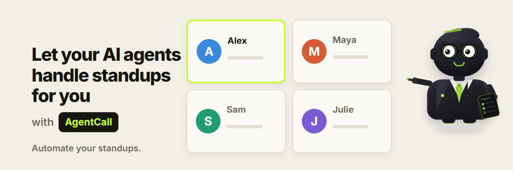

# Standup Manager

<p align="center">
  
</p>

**Let your AI agent run your team's daily standup — so you don't have to.**

Built for **engineering managers and team leads**: point it at your Google Meet / Zoom / Teams call and it
joins as an **audio-only** bot, greets the team, then goes around **one at a time by name** — asking what
each person finished, what's next, and what's blocking them. It **keeps time** (a gentle nudge, then it
moves on, so a 5-person standup is ~7 minutes, not 20), captures every update, and **posts a clean
summary to the meeting chat** when it's done — plus saves it to a dated file you can send anywhere.

And because it's a *manager*, not just a note-taker, it **remembers blockers across days**: next standup
it asks whether last time's blocker is cleared before taking the new update, and carries the open ones
forward — so nothing quietly falls through the cracks.

The point: **make your standup fast, consistent, and effortless.** No camera, no screen-share, no app for
anyone to install. It just talks and listens.

Powered by **[AgentCall](https://agentcall.dev)** · no LLM, no database — just the audio bridge and one script.

---

## What it does

- **Runs the standup for you** — calls on everyone in the call by name; no facilitator, no *"…who's next?"*.
- **No setup** — it uses whoever's in the meeting. There's no team roster to maintain.
- **Keeps it short** — a soft time cap per person, so a 5-person standup takes ~7 minutes, not 20.
- **Remembers blockers across days** — follows up on yesterday's blocker until it's actually cleared.
- **Writes the summary** — every update captured by name, blockers turned into action items, posted to the chat when the round's done.
- **Catches chat updates** — joined on a bad mic? Drop your update in the chat and it's folded in.
- **Stays on as summary manager** — takes a latecomer's update, and reads the summary back on request.
- **Audio only** — no camera, no screen-share, nothing for anyone to install.

---

## Install it

It's a **skill for your AI agent** — so the easiest install is to
**give your agent the repo and say "install it":**

> **Tell your agent:** *"Install the meeting-standup skill from
> `https://github.com/pattern-ai-labs/built-with-agentcall` (the `meeting-standup` folder)."*

Or, one command (works with any agent, needs Node 18+):

```bash
npx skills add pattern-ai-labs/built-with-agentcall --skill meeting-standup
```

**Your AgentCall key** — your agent asks you for it once (grab a free one at
[agentcall.dev/api-keys](https://agentcall.dev/api-keys)) and saves it to `~/.agentcall/config.json`
— the same config file AgentCall uses. If you already use AgentCall, it's already there; nothing to do.

<details>
<summary><b>For devs (optional):</b> clone and run it yourself — no agent needed, just Python 3.10+</summary>

```bash
git clone --filter=blob:none --sparse https://github.com/pattern-ai-labs/built-with-agentcall
cd built-with-agentcall && git sparse-checkout set meeting-standup
cd meeting-standup
python -m venv venv
source venv/bin/activate        # Windows:  venv\Scripts\activate
pip install -r requirements.txt
export AGENTCALL_API_KEY="ak_ac_..."     # Windows:  set AGENTCALL_API_KEY=ak_ac_...
```
</details>

---

## Run it

Just send it into your meeting:

> *"Run my standup: `<meeting link>`"*

Admit the bot (~30–90s). It greets the room and **calls on whoever's in the call** — no team to set up.
It waits for a **"go ahead,"** runs the round, **posts the summary to the chat**, and **stays** to take a
latecomer's update or read the summary back. It leaves when you ask it to, or when everyone else does.
Your summary also lands in [`standups/`](standups/).

No roster, no config needed. Want a fixed order or specific names? See [Make it yours](#make-it-yours).

## Run it yourself (optional, no agent)

Prefer the terminal? Join the meeting first, then:

```bash
python scripts/standup.py "https://meet.google.com/your-link"
```

Or watch the whole flow with no meeting at all — a scripted standup right in your terminal:

```bash
python scripts/standup.py --local
```

<!-- VIDEO: swap YOUTUBE_ID once the walkthrough is uploaded (out/standup-setup.mp4 in the video project)
<p align="center">
  <a href="https://youtu.be/YOUTUBE_ID"></a>
</p>
<p align="center"><sub>▶ <b><a href="https://youtu.be/YOUTUBE_ID">Watch the 2-minute walkthrough</a></b></sub></p>
-->


---

## What you get

A summary posted straight to the meeting chat, and saved to `standups/standup-2026-07-15.md`:

```markdown
# Standup — 2026-07-15 09:30

**Facilitated by** Nova · **Present:** Alex, Priya, Sam · **Duration:** 7m 04s

## Alex
- _Follow-up:_ “blocked on staging access” — ✅ resolved
Shipped the login API and reviewed two PRs. Today: the dashboard.

## Priya
QA'd the signup flow. Next up, the billing emails.
🚩 **Blockers:** waiting on design for the empty states

## Action items
- ☐ Priya: waiting on design for the empty states
```

…plus a `history.json` that quietly remembers who's blocked on what, so tomorrow it can follow up.

---

## How it works

```
  standup.py ──spawns──▶ engine/bridge.py ──▶ AgentCall ──▶ joins the meeting (audio only)
      ▲  │                      │
      │  └── speaks (TTS) ──────┘   calls on people, asks the questions, keeps time
      │
      └── clean events ◀── who joined/left · who said what (with their name)
```

- **AgentCall's audio bridge** gives the bot a voice, a live speaker-attributed transcript, meeting chat,
  and a raised hand — and its built-in barge-in means it won't talk over anyone.
- **`standup.py` runs the meeting** — the round-robin, timeboxing, capture, chat summary, action items,
  cross-day memory, and safe leaving are all deterministic and run on their own, no LLM required.
- **Your AI agent can be the brain** (optional, and recommended) — the bot forwards what it hears to a
  small `link/` file and your agent writes back one line, so it can sharpen the action items, answer
  “what did Alex say?”, and leave when asked. No brittle keyword matching — the agent decides.

The whole thing is turn-based, so only speech crosses the network — it never feels laggy.

---

## Make it yours

- **Fixed order, or specific names?** List your team under `TEAM` in `config.jsonc` (also pins names for cross-day tracking). Leave it empty — the default — and it just calls on whoever's in the call.
- **Different questions?** Edit `QUESTIONS` in `config.jsonc`.
- **Longer or shorter turns?** `PER_PERSON_SECONDS` and `NUDGE_AT_SECONDS`.
- **Post the summary to Slack/email?** Hand the finished `standups/…` file to your AI agent and ask it
  to send it — it's plain Markdown.
- **Async updates for people who can't make it?** A natural next step on top of the base.

---

## Cross-platform

Pure Python + pip wheels (`aiohttp`, `websockets` for the bridge) — no system binaries, no OS-specific
paths. Runs the same on Windows, macOS, and Linux.

---

## License

MIT. The bundled `engine/` bridge is AgentCall's, also MIT. Powered by
[AgentCall](https://agentcall.dev) · [FirstCall](https://firstcall.dev).
